<div align="center">
  
  <h1>Model Card — deepfakes_hunter</h1>
  <p><em>An End-to-End CNN-Based Pipeline for Face Swap Detection in KYC Systems</em></p>
  <p>
    <strong>Javier Javier Daza Olivella</strong> · <a href="mailto:jjdazao@eafit.edu.co">jjdazao@eafit.edu.co</a><br/>
    Advisor: <strong>Pablo Andrés Saldarriaga</strong> · <a href="mailto:psaldar2@eafit.edu.co">psaldar2@eafit.edu.co</a><br/>
    Universidad EAFIT · Maestría en Ciencia de Datos y Analítica · Medellín, 2026
  </p>
</div>

---

## Overview

| Field | Value |
|-------|-------|
| **Task** | Binary face-swap deepfake detection |
| **Final model** | ResNet-50 fine-tuned on deepfake detection |
| **Input** | 224 × 224 RGB face image |
| **Output** | Deepfake probability score (sigmoid) + binary prediction |
| **Threshold** | 0.98 (operational, selected on validation F1) |
| **Export format** | ONNX (CPU / CUDA) |
| **Primary use case** | KYC fraud defense layer — flag face-swapped selfies |
| **License** | MIT |

---

## Intended Use

- **Primary:** Detect face-swap deepfakes in biometric authentication (KYC) flows where a selfie is captured live and compared against an identity document.
- **Secondary:** Research into presentation attack detection for remote onboarding pipelines.
- **Out-of-scope:** General-purpose deepfake video detection, face identification (1:N search), surveillance, or mass content screening. The model is a **defense layer**, not a surveillance tool.

---

## End-to-End Pipeline

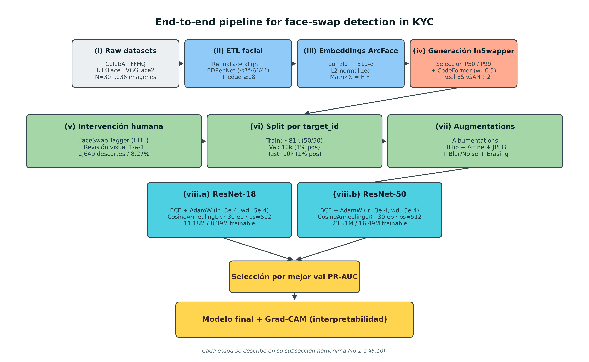

The full pipeline covers eight stages, from raw dataset download to a deployable ONNX checkpoint:

| Stage | Description |
|-------|-------------|
| **(i) Raw datasets** | CelebA, Flickr-Faces-HQ, UTKFace, VGGFace2 — 301 036 images |
| **(ii) ETL facial** | RetinaFace detection + alignment; 6DRepNet pose filter (ISO/IEC 19794-5); age ≥ 18 |
| **(iii) ArcFace embeddings** | 512-dim L2-normalised embeddings; similarity matrix `S = EEᵀ` |
| **(iv) InSwapper generation** | 67 528 face-swaps; targets sampled at P50 and P99 cosine-similarity percentiles |
| **(v) Human-in-the-loop review** | FaceSwap Tagger web tool; 32 040 reviewed; 2 649 (8.27 %) discarded for visible artifacts |
| **(vi) Split by `target_id`** | Train 1:1 balance; Val / Test 99:1 imbalance (mirrors real fraud prevalence) |
| **(vii) Augmentations** | Albumentations pipeline (11 transforms) on train only |
| **(viii) Training** | ResNet-18 (baseline) and ResNet-50 (improved) under identical fine-tuning policy |

---

## Dataset

### Source collections

| Dataset | Original images | License |
|---------|----------------|---------|
| CelebA | ~202 000 | Non-commercial research |
| Flickr-Faces-HQ | ~70 000 | Creative Commons |
| UTKFace | ~20 000 | Research use |
| VGGFace2 | ~3.3 M (subset used) | Research use |

### Post-ETL composition

Real faces enter the dataset in two versions per image: **raw** (straight from ETL) and **raw + CodeFormer** (same image restored without a face-swap). This control prevents the model from using CodeFormer's signature as a discriminative shortcut.

| Split | Positives (deepfakes) | Negatives (real) | Total | % positive | Purpose |
|-------|-----------------------|------------------|-------|------------|---------|
| Train | 39 197 | 39 197 | 78 394 | 50.0 % | Balanced learning |
| Val | 100 | 9 900 | 10 000 | 1.0 % | Checkpoint selection |
| Test | 116 | 11 484 | 11 600 | 1.0 % | Final evaluation |
| **Total** | **39 413** | **60 581** | **99 994** | — | — |

Splits are grouped by `target_id` — zero overlap of identities across splits eliminates context leakage.

### Dataset examples

**Real faces (post-ETL)**

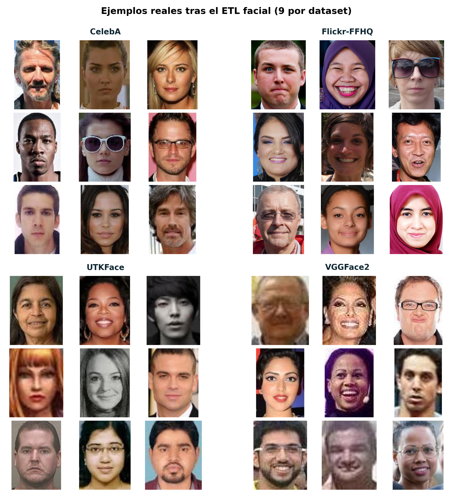

**Face-swaps (InSwapper → CodeFormer → Real-ESRGAN, P99 band)**

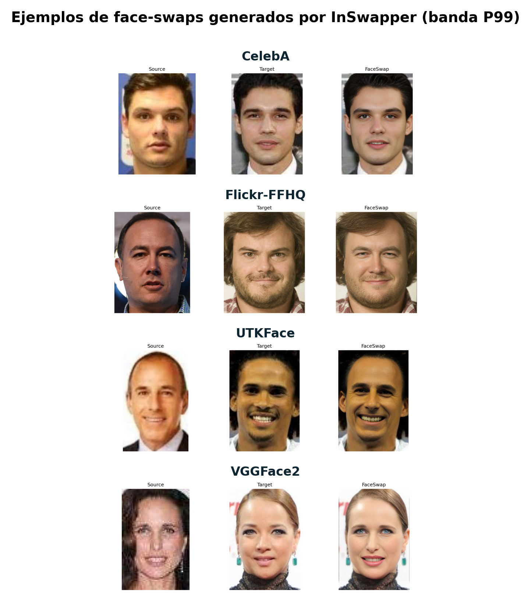

### P50 / P99 pair selection strategy

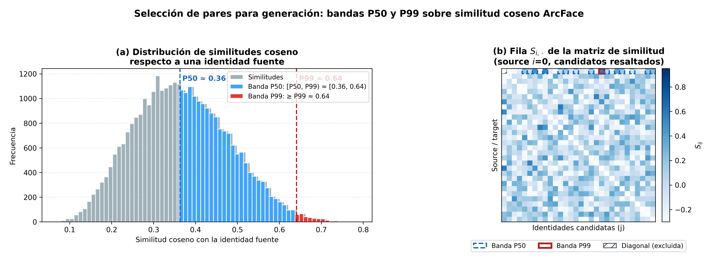

For each source identity, two target images are selected based on cosine similarity of ArcFace embeddings:
- **P50 band** — visually distinguishable swaps (medium difficulty)
- **P99 band** — near-indistinguishable swaps (hard difficulty)

### Dataset demographics

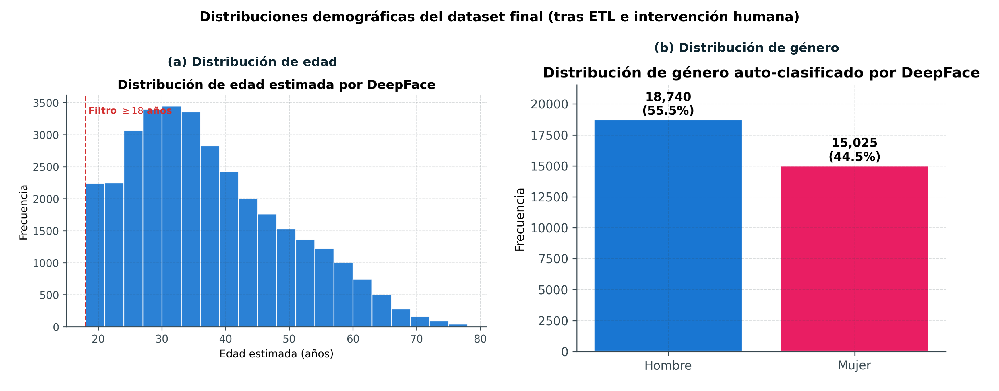

---

## Architecture

Both models share the same fine-tuning policy: **stem + layer1 + layer2 are frozen**; **layer3, layer4, and the classification head are trainable**. The only variable is architectural capacity.


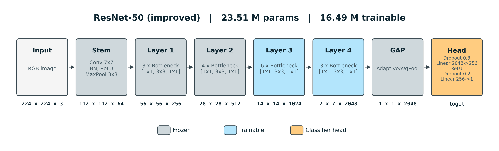

| Component | ResNet-18 (baseline) | ResNet-50 (improved) |
|-----------|----------------------|----------------------|
| Total parameters | 11 177 025 | 23 510 081 |
| Block type | BasicBlock (2 layers) | Bottleneck (3 layers) |
| Stage repetitions [s1,s2,s3,s4] | [2, 2, 2, 2] | [3, 4, 6, 3] |
| Frozen layers | stem, layer1, layer2 | stem, layer1, layer2 |
| Trainable layers | layer3, layer4, head | layer3, layer4, head |
| Trainable params | 8 393 985 | 16 490 753 |
| Final feature map | 7 × 7 × 512 | 7 × 7 × 2048 |
| Classification head | Dropout(0.3) → Linear(512→256) → ReLU → Dropout(0.2) → Linear(256→1) | Dropout(0.3) → Linear(2048→256) → ReLU → Dropout(0.2) → Linear(256→1) |

---

## Training

### Hyperparameters

| Hyperparameter | Value |
|---------------|-------|
| Loss | BCEWithLogitsLoss |
| Optimizer | AdamW |
| Learning rate | 3 × 10⁻⁴ |
| Weight decay | 5 × 10⁻⁴ |
| Scheduler | CosineAnnealingLR (η_min = 10⁻⁶) |
| Batch size | 512 |
| Epochs | 30 |
| Checkpoint selection | Best val PR-AUC |
| Hardware | NVIDIA Tesla V100 · 26 GB VRAM · 8 vCPUs · 64 GB RAM |

### Augmentation pipeline (train only)

| # | Transform | Parameters |
|---|-----------|-----------|
| 1 | Resize | 224 × 224, INTER_LINEAR |
| 2 | HorizontalFlip | p = 0.5 |
| 3 | Affine | scale (0.97, 1.03), translate ±2 %, rotate ±5°, shear ±2°; p = 0.4 |
| 4 | ImageCompression | quality range (50, 95); p = 0.7 |
| 5 | OneOf (degradation) | Downscale 0.7–0.9, GaussianBlur, MotionBlur; p = 0.35 |
| 6 | OneOf (noise) | GaussNoise, ISONoise, MultiplicativeNoise; p = 0.25 |
| 7 | RandomBrightnessContrast | brightness 0.2, contrast 0.2; p = 0.5 |
| 8 | OneOf (color) | HueSaturationValue, RGBShift, ColorJitter; p = 0.35 |
| 9 | CoarseDropout | 1–2 holes, 3–8 % of side; p = 0.2 |
| 10 | Normalize | ImageNet mean / std |
| 11 | ToTensorV2 | — |

Val and Test receive only Resize + Normalize + ToTensorV2.

### Training curves

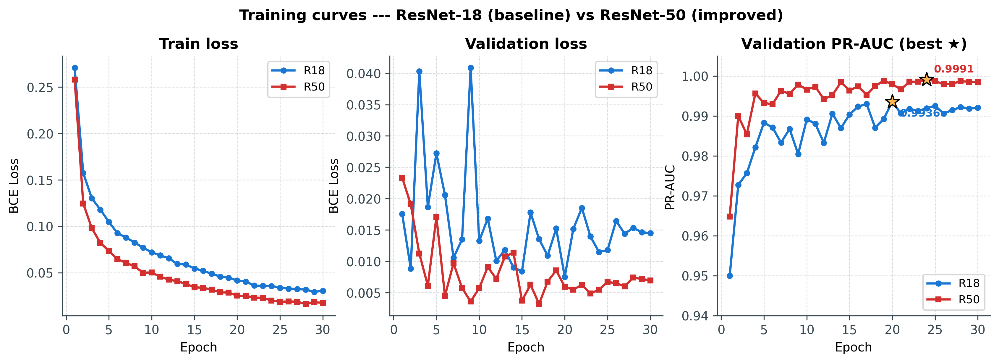

ResNet-50 (red) dominates ResNet-18 (blue) at every epoch and metric. Best checkpoints are marked with ★ (R18: epoch 20, R50: epoch 24).

---

## Results

### Final metrics — Test set (n = 11 600, 99:1 imbalance)

| Metric | ResNet-18 (ep. 20) | ResNet-50 (ep. 24) |
|--------|--------------------|--------------------|
| Accuracy | 0.9994 | **0.9997** |
| Precision | 0.958 | **0.975** |
| Recall | 0.983 | **0.991** |
| F1 (thr = 0.98) | 0.970 | **0.983** |
| PR-AUC | 0.9978 | **0.9977** ¹ |
| ROC-AUC | 0.99998 | **0.99997** |
| True Positives | 114 | **115** |
| False Positives | 5 | **3** |
| True Negatives | 11 479 | **11 481** |
| False Negatives | 2 | **1** |

> ¹ PR-AUC difference (0.0001) is within statistical noise at n = 116 positives. ResNet-50 is preferred for lower FP and FN counts.

PR-AUC is the primary evaluation metric because under 99:1 imbalance, ROC-AUC is inflated by the dominant TN pool and fails to capture the precision/recall trade-off on the minority (deepfake) class.

### Precision-Recall curves

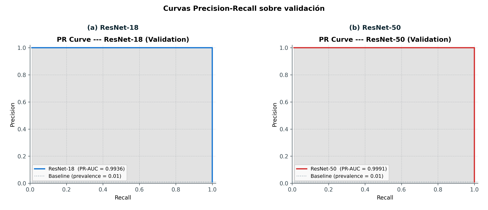

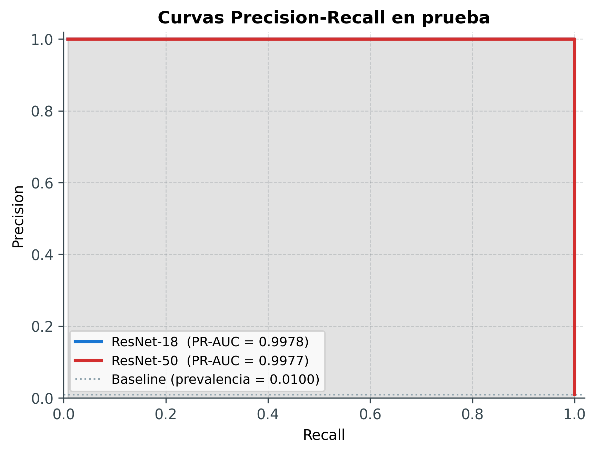

### Confusion matrices (test set, threshold = 0.98)

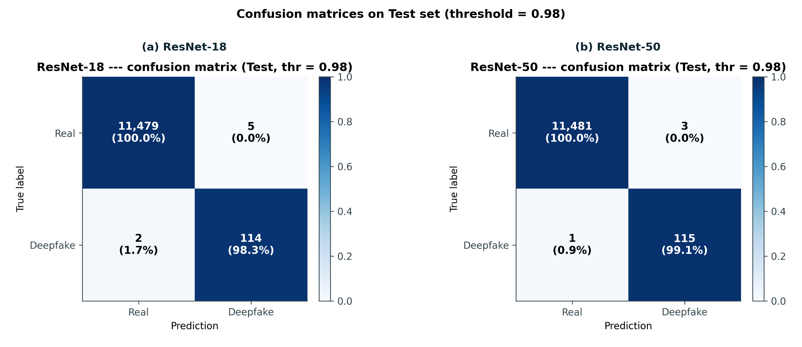

ResNet-50: **3 false positives and 1 false negative** over 11 600 samples.

### Score distributions (validation)

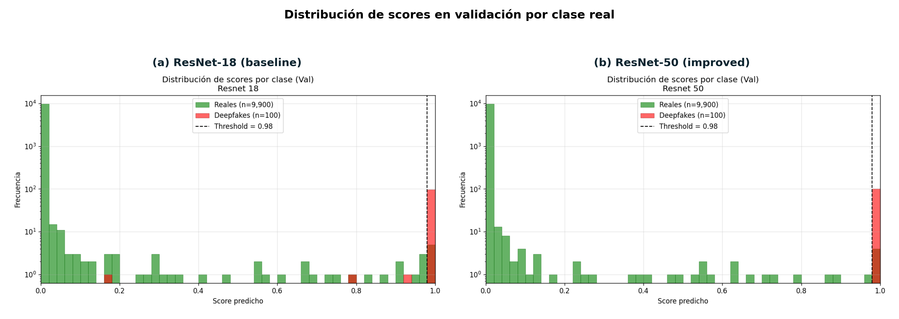

ResNet-50 produces near-binary separation: real faces cluster near 0, deepfakes near 1.

### Threshold selection

The optimal threshold by F1 is ≈ 0.98 for both models on the validation set.

| Model | F1 @ thr = 0.5 | Recall @ 0.5 | F1 @ thr ≈ 0.98 | Recall @ 0.98 |
|-------|----------------|--------------|-----------------|---------------|
| ResNet-18 | 0.892 | 0.99 | 0.960 | 0.97 |
| ResNet-50 | 0.922 | 1.00 | **0.980** | 1.00 |

---

## Interpretability — Grad-CAM

Grad-CAM is applied on `layer4[-1]` (last convolutional layer) with the logit as the class target.

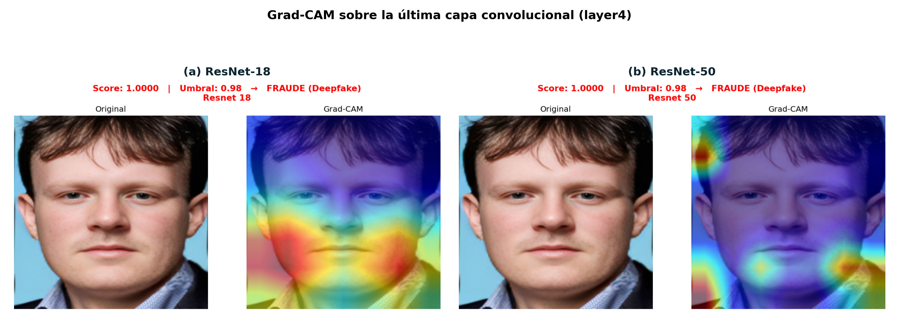

Activations concentrate consistently in the **mid-face region (eyes–nose)** for both models — the manipulation zone where InSwapper blends the swapped identity. There is no single-region shortcut: attention is distributed across the face, consistent with the model learning a manipulation signature rather than memorising generator-specific artifacts.

---

## Latency

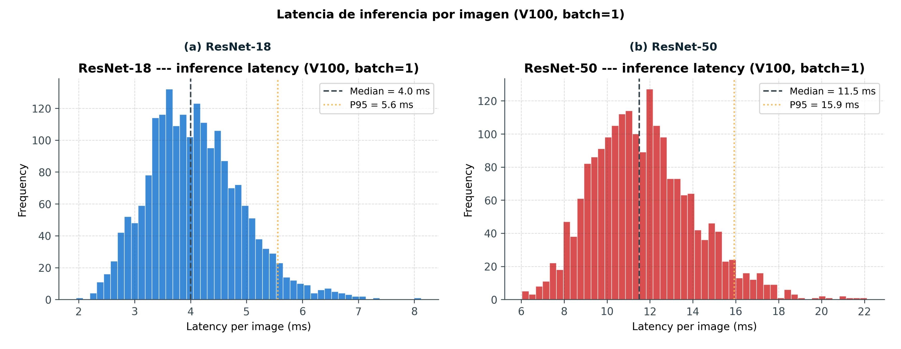

ResNet-50 pays ≈ 3× the inference cost of ResNet-18 (both on CPU, batch size 1, V100). For latency-critical deployments, ResNet-18 offers near-identical PR-AUC at a fraction of the compute.

---

## Limitations

- **Generator generalisation:** The model was trained exclusively on InSwapper swaps. Performance may degrade on diffusion-based generators (SimSwap, MegaPixel, FLUX) not seen during training.
- **Implicit source leakage:** Source identities are not fully separated between train and test (only `target_id` grouping is applied). A source face appearing as real in train could appear as the swapped identity in a test positive — accepted because the face-swap changes the phenomenological appearance of the source.
- **Demographic bias:** The dataset is reasonably diverse but not equitably representative of all demographic groups. A formal fairness audit by subgroup (age / gender / origin) is identified as future work.
- **False positives:** Most FPs share characteristics of selfies with heavy post-processing: harsh lighting, unusual colour saturation, or device-native filters — conditions that visually resemble CodeFormer restoration artifacts.

---

## Ethical considerations

- All source datasets are distributed under academic-use verified licenses. An age ≥ 18 filter is applied in ETL — no synthetic content is generated from minors.
- Face-swap generation is performed solely to train a detector; the swaps are not distributed as standalone content.
- The model is intended as a **defense layer against fraud**, not a surveillance tool. Any deployment should include human-in-the-loop review of rejections to limit false-positive friction on legitimate users.

---

## Citation

```
Daza Olivella, J. J. (2026). An End-to-End CNN-Based Pipeline for Face Swap Detection
in KYC Systems with Interpretability Analysis. Master's thesis,
Universidad EAFIT, Medellín, Colombia.
```
